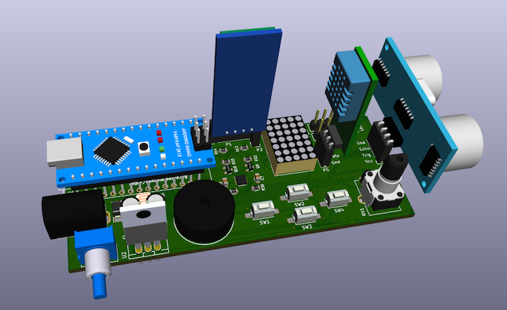
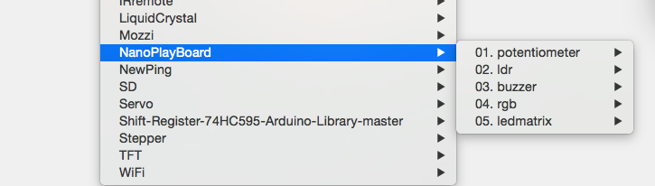
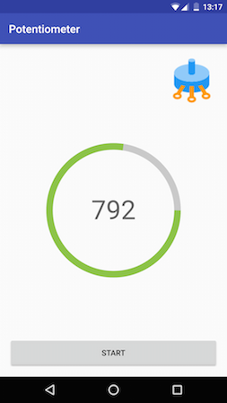
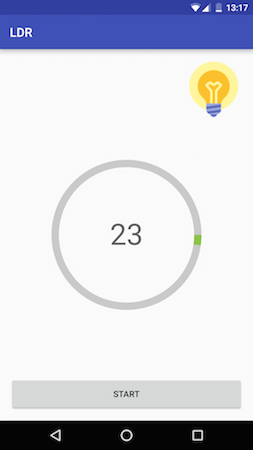
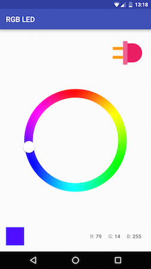
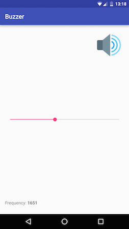
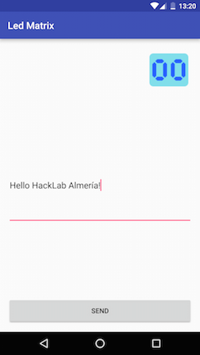
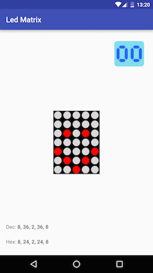

{: .center}

<a name="Placa-NanoPlayBoard"></a>

## **¿Qué es la Arduino NanoPlayBoard?**

Es una placa de **iniciación a la experimentación** que permite el **aprendizaje de electrónica básica y programación** haciendo uso del microcontrolador [Arduino Nano 3.x][1] o compatibles.

Dispone de varios sensores, actuadores y puertos para la conexión con otras placas de forma que sea posible explotar parte de las funcionalidades de la plataforma Arduino.

### Sensores
- Una **fotoresistencia**.
- Un **potenciómetro**.
- Cuatro **pulsadores**.
- Un **acelerómetro de tres ejes**.
- Un **encoder incremental de 16 pasos/revolución**.

### Actuadores
- Un **buzzer**.
- Un **led RGB**.
- Una **matriz de led's**.

### Puertos
- Un **zócalo hembra** para conectar un **detector de objetos por ultrasonidos**.
- Un **zócalo hembra** para conectar un **sensor de temperatura y humedad tipo DTH11/DTH22**.
- Dos **zócalos macho** para conectar **dos servomotores**.
- Un **zócalo hembra** para conectar un **módulo Bluetooth HC-05/HC-6**.

---

## Open Source Hardware

La placa **Arduino Nano Play Board** es **[Hardware de Fuentes Abiertas (OSHW)][3]**, lo que quiere decir que su [diseño está disponible públicamente en GitHub][2] para que cualquier persona lo pueda estudiar, modificar, distribuir, materializar y vender, tanto el original como otros objetos basados en ese diseño.

{: .center}

---

<a name="Libreria-Arduino"></a>

## **Librería para la Arduino NanoPlayBoard**

Hemos desarrollado una **librería para facilitar el uso y el acceso a los recursos** que ofrece la placa.

### Instalación

* [Descarga la librería **NanoPlayBoard.zip**][4].
* Abre **Arduino IDE** y selecciona `Programa > Incluir Librería > Añadir librería .ZIP`.
* Reinicia **Arduino IDE**.
* Ahora puedes acceder a los ejemplos en el menú `Archivo > Ejemplos > NanoPlayBoard`.

{: .center}

### Primeros pasos

#### Potentiometer

```c++
NanoPlayBoard board;
int value = board.potentiometer.read();
```

#### LDR

```c++
NanoPlayBoard board;
int value = board.ldr.read();
```

#### Buzzer

```c++
NanoPlayBoard board;
board.buzzer.playTone(440);
```

#### LED RGB

```c++
NanoPlayBoard board;
board.rgb.write(255, 0, 0);  
```

#### LED Matrix

```c++
NanoPlayBoard board;
board.ledmatrix.print("H o l a  m u n d o!");
```

La librería también nos permite controlar la velocidad del scroll utilizada para visualizar el texto en la matriz de leds.

```c++
board.ledmatrix.setScrollSpeed(10);
board.ledmatrix.print("H o l a  m u n d o!");
```

---

<a name="Aplicacion-Android"></a>

## **Android App para la Arduino NanoPlayBoard**

Hemos desarrollado una **aplicación Android** que nos permite interaccionar con la placa.

{: .center}

### ¿Qué necesito para utilizar la app?

* Una placa [Arduino Nano Play Board][2].
* Un [Arduino Nano][1].
* Un dispositivo Android (version >= 4.1.x).

Y al menos _una de estas dos opciones_:

  * Un **módulo Bluetooth** compatible con Arduino (HC-05 o HC-06).
  * Un **cable USB OTG**.

### Screenshots








---

<a name="Johnny-Five"></a>

## **Programa tu NanoPlayBoard en Javascript con Johnny-Five**

{: .center}

Gracias al framework **[Johnny-Five][8]** también **puedes programar tu NanoPlayBoard en Javascript**.

En [GitHub][7] hemos publicado un **[repositorio con algunos ejemplos][7]**.

### Primeros pasos

* Instala [Node.js][9].
* Configura tu **NanoPlayBoard** cargando el sketch [StandardFirmata][10] ([instrucciones adicionales][11]).
* Instala [Johnny-Five][8]: `npm install johnny-five`
* Ejecuta los ejemplos: `node blink.js`

---

## Créditos

* La placa [Arduino Nano Play Board][2] ha sido diseñada por [Antonio Morales][antonio].
* La [librería para Arduino][5] ha sido desarrollada por [Antonio Morales][antonio] y [José Juan Sánchez][josejuan].
* La [aplicación Android][6] ha sido desarrollada por [José Juan Sánchez][josejuan].

[1]: http://www.arduino.cc/en/Main/ArduinoBoardNano
[2]: http://github.com/AntonioMR/Nano-Play-Board
[3]: http://www.oshwa.org/definition/spanish/
[4]: http://github.com/josejuansanchez/NanoPlayBoard-Arduino-Library/releases
[5]: http://github.com/josejuansanchez/NanoPlayBoard-Arduino-Library
[6]: https://github.com/josejuansanchez/NanoPlayBoard-Android-App
[7]: https://github.com/josejuansanchez/NanoPlayBoard-Johnny-Five
[8]: http://johnny-five.io
[9]: https://nodejs.org/download/
[10]: https://github.com/firmata/arduino
[11]: http://johnny-five.io/platform-support/#arduino-nano


[antonio]: http://twitter.com/antonio1010mr
[josejuan]: http://josejuansanchez.org