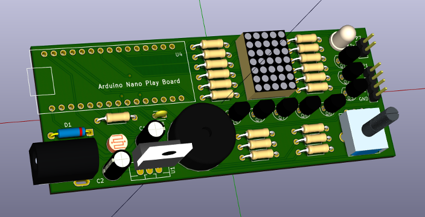

{: .center}

## ¿Qué es la **Arduino NanoPlayBoard**?

Es una placa de **iniciación a la experimentación** que permite el **aprendizaje de electrónica básica y programación** haciendo uso del microcontrolador [Arduino Nano 3.x][1] o compatibles.

Dispone de varios sensores, actuadores y puertos para la conexión con otras placas de forma que sea posible explotar parte de las funcionalidades de la plataforma Arduino.

### Sensores
- Una **fotoresistencia**.
- Un **potenciómetro**.
- Cuatro **pulsadores**.
- Un **acelerómetro de tres ejes**.
- Un **encoder incremental de 16 pasos/revolución**.

### Actuadores
- Un **buzzer**.
- Un **led RGB**.
- Una **matriz de led's**.

### Puertos
- Un **zócalo hembra** para conectar un **detector de objetos por ultrasonidos**.
- Un **zócalo hembra** para conectar un **sensor de temperatura y humedad tipo DTH11/DTH22**.
- Dos **zócalos macho** para conectar **dos servomotores**.
- Un **zócalo hembra** para conectar un **módulo Bluetooth HC-05/HC-6**.

[1]: https://www.arduino.cc/en/Main/ArduinoBoardNano