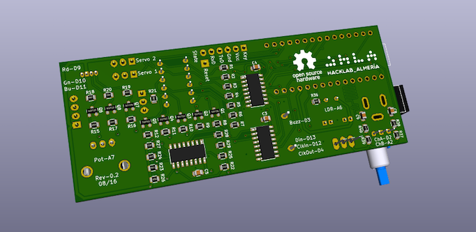

{: .center}

## ¿Qué es la **Arduino NanoPlayBoard**?

Es una placa de **iniciación a la experimentación** que permite el **aprendizaje de electrónica básica y programación** haciendo uso del microcontrolador [Arduino Nano 3.x][1] o compatibles.

Dispone de varios sensores, actuadores y puertos para la conexión con otras placas de forma que sea posible explotar parte de las funcionalidades de la plataforma Arduino.

### Sensores
- Una **fotoresistencia**.
- Un **potenciómetro**.
- Cuatro **pulsadores**.
- Un **acelerómetro de tres ejes**.
- Un **encoder incremental de 16 pasos/revolución**.

### Actuadores
- Un **buzzer**.
- Un **led RGB**.
- Una **matriz de led's**.

### Puertos
- Un **zócalo hembra** para conectar un **detector de objetos por ultrasonidos**.
- Un **zócalo hembra** para conectar un **sensor de temperatura y humedad tipo DTH11/DTH22**.
- Dos **zócalos macho** para conectar **dos servomotores**.
- Un **zócalo hembra** para conectar un **módulo Bluetooth HC-05/HC-6**.

---

## Open Source Hardware

La placa **Arduino Nano Play Board** es **[Hardware de Fuentes Abiertas (OSHW)][3]**, lo que quiere decir que su [diseño está disponible públicamente en GitHub][2] para que cualquier persona lo pueda estudiar, modificar, distribuir, materializar y vender, tanto el original como otros objetos basados en ese diseño.

{: .center}

---

## Librería para la **Arduino NanoPlayBoard**

Hemos desarrollado una **librería para facilitar el uso y el acceso a los recursos** que ofrece la placa.

### Instalación

* [Descarga la librería **NanoPlayBoard.zip**][4].
* Abre **Arduino IDE** y selecciona `Programa > Incluir Librería > Añadir librería .ZIP`.
* Reinicia **Arduino IDE**.
* Ahora puedes acceder a los ejemplos en el menú `Archivo > Ejemplos > NanoPlayBoard`.

{: .center}

### Primeros pasos

#### Potentiometer


NanoPlayBoard board;
int value = board.potentiometer.read();


#### LDR


NanoPlayBoard board;
int value = board.ldr.read();


#### Buzzer


NanoPlayBoard board;
board.buzzer.playTone(440);


#### LED RGB


NanoPlayBoard board;
board.rgb.write(255, 0, 0);  


#### LED Matrix


NanoPlayBoard board;
board.ledmatrix.print("H o l a  m u n d o!");


La librería también nos permite controlar la velocidad del scroll utilizada para visualizar el texto en la matriz de leds.


board.ledmatrix.setScrollSpeed(10);
board.ledmatrix.print("H o l a  m u n d o!");


---

## Créditos

* La placa [Arduino Nano Play Board][2] ha sido diseñada por [Antonio Morales][6].
* La [librería para Arduino][5] ha sido desarrollada por [Antonio Morales][6] y [José Juan Sánchez][7].

[1]: http://www.arduino.cc/en/Main/ArduinoBoardNano
[2]: http://github.com/AntonioMR/Nano-Play-Board
[3]: http://www.oshwa.org/definition/spanish/
[4]: http://github.com/josejuansanchez/NanoPlayBoard-Arduino-Library/releases
[5]: http://github.com/josejuansanchez/NanoPlayBoard-Arduino-Library
[6]: http://twitter.com/antonio1010mr
[7]: http://josejuansanchez.org